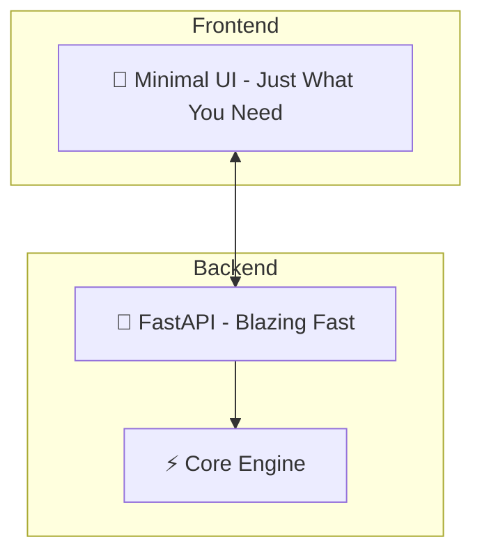

# Test Data Generator - Architecture Plan

## Core Philosophy
⚡ **Fast** - Lightning quick generation, no loading spinners
🎨 **Fresh** - Vibrant colors, fun animations, no corporate boringness  
🎮 **Entertaining** - Micro-interactions, fun copy, easter eggs

## Architecture


## Performance Goals
- **Backend cold start**: < 100ms
- **API response time**: < 10ms per request
- **Frontend bundle size**: < 100KB gzipped
- **No loading states** - everything instant

## Tech Stack - Keep It Minimal

### Backend
- **FastAPI** - Ultra fast, auto-docs
- **Faker** - Data generation
- **No database initially** - In-memory for speed
- **Optional SQLite** - Only if history needed

### Frontend
- **HTMX** - No heavy React, just HTML + sprinkles
- **Alpine.js** - Lightweight interactivity (< 10KB)
- **TailwindCSS** - Rapid styling
- **Custom CSS** - Fun animations

Why HTMX + Alpine? 
- ⚡ No build step required
- 🎯 Zero JavaScript boilerplate
- 🚀 Instant page loads
- 🎨 Full control over design

## Supported Data Types
- UUID 🎲
- Phone 📞
- Email 📧
- Address 🏠
- Name 👤
- IMEI 📱
- Credit Card 💳
- SSN 🔢
- IP Address 🌐
- Date 📅
- Custom Pattern 🎨

## UI Design - Fun & Fresh

### Color Palette
- Primary: Electric Purple (#8B5CF6)
- Accent: Hot Pink (#EC4899)
- Success: Lime Green (#84CC16)
- Background: Deep Navy (#0F172A)
- Cards: Semi-transparent glass effect

### Typography
- Headings: Bold, playful font (e.g., Poppins)
- Body: Clean, readable (e.g., Inter)
- Monospace: JetBrains Mono for data

### Fun Elements
- Animated icons for each data type
- Satisfying click animations
- Satisfying copy feedback ("Boom!", "Poof!", "Magic!")
- Random fun messages on generation
- Easter eggs for power users

### UI Layout - Single Page Fun
```
┌─────────────────────────────────────────────────┐
│  🎲 Test Data Generator                         │
│  ━━━━━━━━━━━━━━━━━━━━━━━━━━━━━━━━━━━━━━━━━━━━━━ │
│                                                 │
│  ┌──────┐  ┌─────────────────────────────────┐ │
│  │UUID  │  │  Prefix  [____]                 │ │
│  │📞   │  │  Suffix  [____]                  │ │
│  │📧   │  │  Count   [====⚡] 5              │ │
│  │🏠   │  │                                 │ │
│  │👤   │  │       [✨ POOF! Generate]       │ │
│  │📱   │  │                                 │ │
│  │💳   │  │  ┌─────────────────────────────┐│ │
│  │🔢   │  │  │ uuid_prefix_1234...  [📋]   ││ │
│  │🌐   │  │  │ uuid_abcd_5678...    [📋]   ││ │
│  │📅   │  │  │ uuid_xyz_9999...     [📋]   ││ │
│  │🎨   │  │  └─────────────────────────────┘│ │
│  └──────┘  │  [📥 Export JSON] [📋 Copy All]│ │
│            └─────────────────────────────────┘ │
│                                                 │
└─────────────────────────────────────────────────┘
```

## API Endpoints - Keep It Simple

```
GET  /api/types              - List all data types
POST /api/generate           - Generate data
GET  /api/random-message     - Get fun message 🎉
```

### Request/Response
```json
POST /api/generate
{
  "type": "uuid",
  "prefix": "test_",
  "suffix": null,
  "count": 5
}

Response:
{
  "success": true,
  "message": "✨ Poof! 5 UUIDs ready!",
  "data": ["test_uuid1", "test_uuid2", ...]
}
```

## Prefix/Suffix Logic
```
Default:        data_type → default length
With prefix:    prefix + truncated_data → same total length
With suffix:    truncated_data + suffix → same total length
With both:      prefix + truncated_data + suffix
```

## Project Structure - Ultra Minimal
```
test-data-generator/
├── backend/
│   ├── main.py              # FastAPI app + all logic
│   └── requirements.txt
├── frontend/
│   ├── index.html           # Single HTML file!
│   ├── style.css            # Custom styles + animations
│   └── script.js            # Alpine.js magic
└── README.md
```

## Performance Optimizations
1. **Backend**:
   - Singleton generator instances
   - Pre-warmed Faker instances
   - In-memory caching

2. **Frontend**:
   - No build step
   - CDN for Alpine.js and Tailwind
   - CSS animations over JS animations
   - Debounced inputs

3. **API**:
   - Async throughout
   - Minimal serialization
   - Gzip compression

## Fun Features

### Generation Messages
- "🎉 Boom! Data incoming!"
- "✨ Poof! All done!"
- "🚀 Ready for liftoff!"
- "🎯 Bullseye!"
- "🪄 Magic happens here!"
- "⚡ ZAP! Done!"

### Data Type Animations
- UUID: Spinning dice
- Phone: Ringing phone shake
- Email: Envelope flap
- Address: House bounce
- Name: Person waving
- IMEI: Phone vibration

### Easter Eggs
- Type `/party` for confetti 🎊
- Double click logo for disco mode 🕺
- Hover over generated data for surprise 😏

## Implementation Steps

### Phase 1: Backend Core
- [ ] FastAPI setup with single file
- [ ] Generator engine with all data types
- [ ] Prefix/suffix modifier logic
- [ ] API endpoints
- [ ] Fun message system

### Phase 2: Frontend Fun
- [ ] Single HTML file with Tailwind
- [ ] Alpine.js interactivity
- [ ] Beautiful data type cards
- [ ] Configuration form
- [ ] Results grid with copy buttons
- [ ] Fun animations and micro-interactions

### Phase 3: Polish & Launch
- [ ] Export functionality
- [ ] Easter eggs
- [ ] Performance testing
- [ ] README with examples

## Dependencies - Bare Minimum

### Backend (3 packages)
```
fastapi
uvicorn
faker
```

### Frontend (via CDN - no install needed)
- TailwindCSS (via CDN for dev, CLI for prod)
- Alpine.js
- No React/Vue/Angular!

## Why This Approach?

| Approach | Bundle Size | Build Step | Learning Curve | Fun Factor |
|----------|-------------|------------|----------------|------------|
| React    | ~150KB      | Required   | Steep          | Medium     |
| Vue      | ~100KB      | Required   | Medium         | Medium     |
| **HTMX+Alpine** | **<20KB** | **None** | **Low** | **High** |

## Example Usage

### Web UI
Open `index.html` in browser - done! ✨

### API
```bash
# Start server
uvicorn backend.main:app --reload

# Generate data
curl -X POST "http://localhost:8000/api/generate" \
  -H "Content-Type: application/json" \
  -d '{"type": "uuid", "prefix": "test_", "count": 3}'
```

### Automation
```python
import httpx

# Fast async client
async def generate_test_data():
    async with httpx.AsyncClient() as client:
        r = await client.post("http://localhost:8000/api/generate", json={
            "type": "email",
            "prefix": "test_",
            "count": 10
        })
        return r.json()["data"]
```
